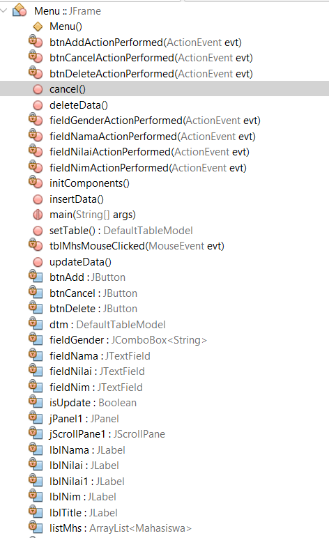
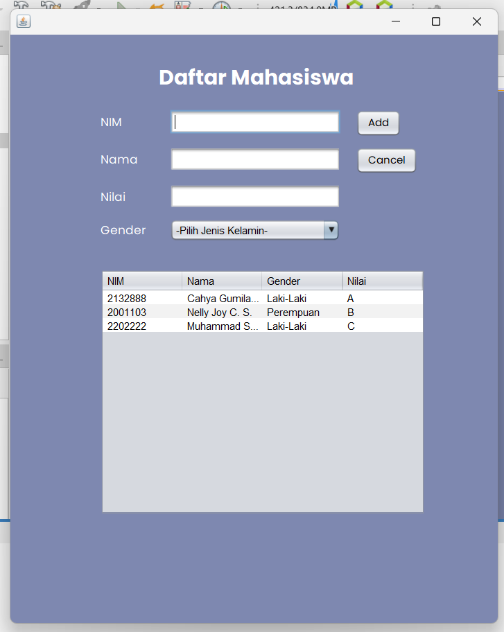

# LATIHAN5DPBO

>Saya Atta Arrezie Kurnia (2006836) mengerjakan Latihan 5 dalam mata kuliah Desain dan Pemrograman Berorientasi Objek untuk keberkahanNya maka saya tidak melakukan kecurangan seperti yang telah dispesifikasikan. Aamiin

#### Latihan 5 - Java GUI
Pada tugas ini terdapat file jar ('Hasil.jar') didalam folder 'DaftarMahasiswa_3_1' yang merupakan hasil tugas yang telah saya kerjakan. Untuk source code beserta file jar  juga dilampirkan pada folder 'DaftarMahasiswa_3_1'. Berikut penjelasan mengenai apa yang telah saya kerjakan beserta dokumentasi hasilnya.

1. Id setiap komponen telah diubah sesuai kegunaan/fungsinya. 
   
   
2. Berikut hasil tampilan program dimana terdapat atribut yang ditambahkan, yaitu atribut gender yang menggunakan combo box. Telah ditambahkan kolom untuk menampilkan atribut Kelamin. Selain, itu, telah ditambahkan juga data Dummy untuk preview tampilan tabel jika diisi data
    
    
    
3. Terdapat 4 perintah yaitu add, update, delete, dan cancel. Pada semua perintah tersebut telah dibuat validation form berupa pop-up massage, setelah setiap perintah juga text field dibersihkan, dan ketika data pada tabel diklik akan muncul button 'update' dan 'delete'. Berikut beberapa dokumentasi perintah yang telah dilakukan.
   - Perintah 'add', dimana setelah data ditambahkan text field dibersihkan dan table di update. 
     
     
   - Perintah 'cancel', dimana setelah dicancel text field akan dibersihkan. 
     
     
   - Perintah 'update', dimana jika data pada table diklik, maka perintah add menjadi update, dan data yang diklik akan muncul pada textfield sehingga dapat diubah. Setelah tombol diklik, text field dibersihkan dan table diupdate. 
     
     
   - Perintah 'delete'. dimana jika data pada tabel diklik, maka perintah delete muncul dan setelah diklil tombol delete, maka data text field dibersihkan dan tabel duipdate. 
     
     
4. Validation, ketika salah satu field kosong dan ada perintah yang diklik (update, add, dan delete), maka akan puncul pesan pop-up yang memberitahu field mana yang belum diisi. 
   
   
   
   note : kayaknya gif tidak dapat ditampilkan pada readme file, oleh karena itu untuk dokumentasi percobaan program dapat langsung diliat pada folder asset dgn keterangan ->
   - Add data -> dapat dilihat pada file Insert.gif
   - Update -> dapat dilihat pada file Update.gif
   - Delete -> dapat dilihat pada file Delete.gif
   - Cancel fill form -> dapat dilihat pada file Cancel.gif
   - Validation form -> dapat dilihat pada file check.gif
